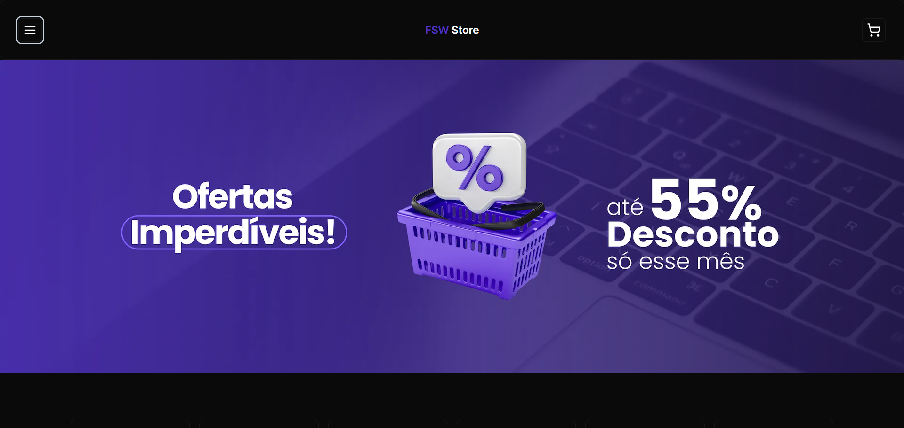
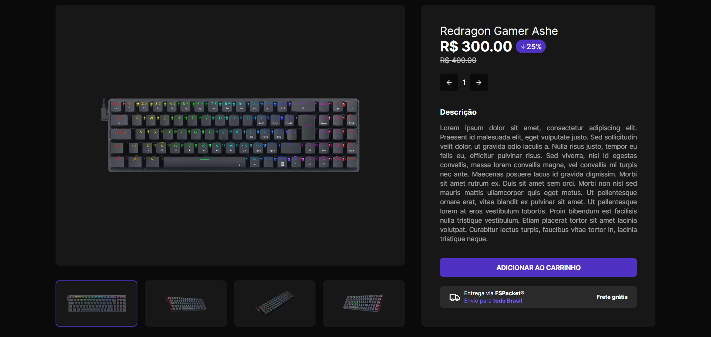
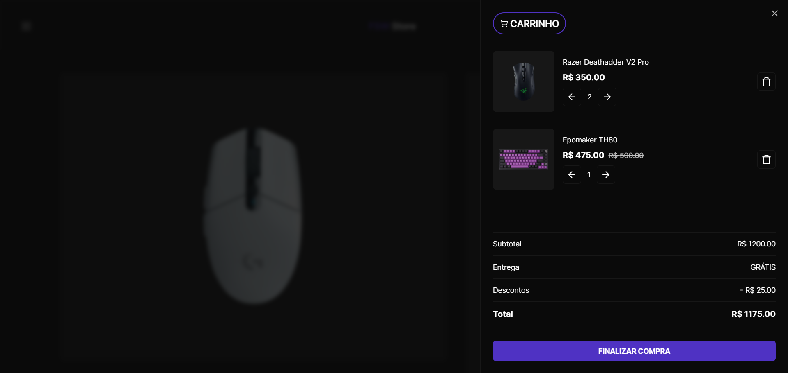

# Full Stack Week Store

🚀 Olá pessoal! Aqui está o nosso incrível repositório do e-commerce, fruto de todo o entusiasmo vivido durante a Full Stack Week, um evento sensacional com quatro lives cheias de conteúdo incrível! Nossa missão? Estamos mergulhados na criação de um projeto super relevante, utilizando as tecnologias mais modernas e requisitadas pelo mercado.

🛠️ Agora, imersos nesse projeto empolgante, estamos comprometidos em construir uma experiência de e-commerce única. 💡 Estamos explorando as tecnologias mais quentes do momento para entregar não apenas um site, mas uma verdadeira obra de arte digital que vai surpreender e encantar todos vocês. 🌐✨ Mal podemos esperar para compartilhar cada etapa dessa jornada emocionante com todos vocês! 🚀👩‍💻👨‍💻

## Tecnologias Utilizadas 🚀

- [React](https://pt-br.reactjs.org/) - Uma biblioteca JavaScript incrivelmente popular, projetada para facilitar a criação de interfaces de usuário interativas e envolventes.
- [Next.js 13](https://nextjs.org/) - Imagine um mundo onde desenvolver com React se torna ainda mais poderoso. Apresentamos o Next.js 13, um framework React que eleva a experiência com recursos como renderização do lado do servidor (SSR), geração estática (SSG) e muito mais. É a magia do React, agora potencializada!
- [Next Auth](https://next-auth.js.org/) - Diz adeus às complicações na autenticação de usuários! Com o Next Auth, estamos simplificando a autenticação com OAuth, tornando a segurança uma jornada tranquila.
- [Postgres](https://www.postgresql.org/) - Nossas bases são sólidas. O Postgres é o sistema de gerenciamento de banco de dados relacional que confiamos para fornecer uma fundação robusta para nossos dados.
- [Prisma](https://www.prisma.io/) - Conectando o Node.js e o TypeScript ao universo de bancos de dados. Prisma é nosso aliado, um ORM (Object-Relational Mapping) que traz eficiência e simplicidade à interação com os dados.
- [Supabase](https://supabase.io/) - O Supabase é uma plataforma de desenvolvimento de código aberto que facilita a criação de aplicativos e APIs. Com o Supabase, temos à disposição uma variedade de ferramentas que nos permitem criar aplicativos com rapidez e facilidade.
- [shadcn/ui](https://ui.shadcn.com/) - A estética encontra a praticidade. Descubra uma gama de componentes de IU reutilizáveis e estilizáveis, cortesia da nossa biblioteca shadcn/ui.
- [Tailwind CSS](https://tailwindcss.com/) - Pintamos a web com facilidade. Utilizando o Tailwind CSS, temos à disposição uma variedade de classes pré-estilizadas, proporcionando uma experiência de design fluida e descomplicada.
- [API do Stripe](https://stripe.com/br) - Quando se trata de pagamentos online, escolhemos o melhor. A API do Stripe é nossa escolha para processar pagamentos de maneira segura, proporcionando tranquilidade tanto para nós quanto para nossos usuários.
- [Stripe CLI](https://stripe.com/docs/stripe-cli) - O Stripe CLI é uma ferramenta de linha de comando que permite interagir com a API do Stripe para testar integrações, gerenciar produtos e muito mais.
- [Vercel](https://vercel.com/) - A Vercel é uma plataforma de nuvem para sites estáticos e aplicativos front-end. Com a Vercel, temos à disposição uma variedade de ferramentas que nos permitem implantar aplicativos com rapidez e facilidade.

## Funcionalidades 📦

- [x] 🔐 Login com o Google: Tornamos o acesso mais fácil do que nunca! Agora, você pode fazer login utilizando sua conta do Google, proporcionando uma experiência de autenticação simplificada e segura.
- [x] 🗺️ Navegação por Categorias: Explore nossos produtos de forma intuitiva! Crie uma jornada de compras personalizada, navegando por categorias que facilitam a busca e a compra dos itens que você adora.
- [x] 💰 Descontos em Produtos: Porque todos merecem um mimo! Descubra produtos com descontos especiais, permitindo que você economize enquanto faz suas compras. Afinal, quem não adora um bom negócio?
- [x] 🛒 Gerenciamento do Carrinho de Compras: Facilitamos suas compras online! Adicione produtos ao seu carrinho, remova itens ou ajuste as quantidades conforme sua necessidade. É a praticidade que você merece.
- [x] 💳 Pagamento do Pedido com a API do Stripe: Sua segurança é nossa prioridade! Ao utilizar a API do Stripe, garantimos uma experiência de pagamento online segura. Com a integração de webhooks, processamos eventos relacionados ao pagamento para que você possa concluir seus pedidos com facilidade e confiança. Sua jornada de compra, do início ao fim, é nossa prioridade! 🚀🛍️

## Screenshots 📷

- Home




- Produto



- Carrinho de Compras



## Pré-requisitos 📋

Antes de começar, você vai precisar ter instalado em sua máquina as seguintes ferramentas:

- [Node.js](https://nodejs.org/en/) - O Node.js é um interpretador de código JavaScript com o código aberto, focado em migrar o Javascript do lado do cliente para servidores.
- [Stripe CLI](https://stripe.com/docs/stripe-cli) - O Stripe CLI é uma ferramenta de linha de comando que permite interagir com a API do Stripe para testar integrações, gerenciar produtos e muito mais.

## Como executar o projeto 🚀

Para executar o projeto, você deve seguir as seguintes etapas:

1. Clone o repositório

```bash
git clone https://github.com/rafaelmachadobr/fullstackweek-store.git
```

2. Entre na pasta do projeto

```bash
cd fullstackweek-store
```

3. Instale as dependências

```bash
npm install
```

4. Crie um arquivo .env e adicione as variáveis de ambiente

```bash
echo > .env
```

5. Adicione as variáveis de ambiente ao arquivo .env

```bash
DATABASE_URL=
GOOGLE_CLIENT_ID=
GOOGLE_CLIENT_SECRET=
STRIPE_SECRET_KEY=
STRIPE_WEBHOOK_SECRET_KEY=
NEXT_PUBLIC_STRIPE_PUBLIC_KEY=
NEXTAUTH_SECRET=
HOST_URL=
```

6. Execute as migrations

```bash
npm run prisma:migrate
```

7. Execute o projeto

```bash
npm run dev
```

8. Acesse o projeto no seu navegador

[http://localhost:3000](http://localhost:3000)

## Licença 📝

Este projeto está licenciado sob a Licença MIT - consulte o arquivo [LICENSE](LICENSE) para obter detalhes.
